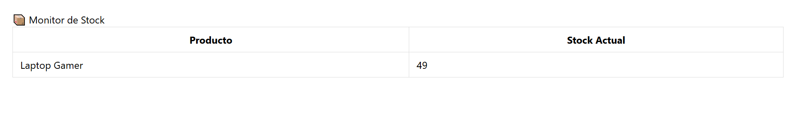

# 📦 Monitor de Stock en Tiempo Real con Laravel 12 + Reverb

Este documento es una guía paso a paso y un análisis detallado de cómo construir un monitor de inventario en tiempo real. El objetivo es que cualquier cambio en el stock de un producto en la base de datos se refleje instantáneamente en el navegador de todos los usuarios conectados, sin necesidad de recargar la página.

Utilizamos **Laravel 12** para el backend, **Reverb** como nuestro servidor WebSocket nativo, y **Laravel Echo** en el frontend para la comunicación.

---

## 💡 ¿Cómo Funciona? (La Teoría)

Antes de escribir código, es crucial entender el flujo de la información. El proceso es como una cadena de radio bien coordinada:

1.  **El Hecho (BD):** Un producto se actualiza en la base de datos (ej. `stock` cambia de 50 a 49).
2.  **El Gatillo (Eloquent):** El modelo Eloquent (`Product`) detecta este cambio (el evento `updated`).
3.  **El Mensajero (Evento Laravel):** El modelo dispara un evento de broadcasting (`StockUpdated`). Este evento contiene los nuevos datos (ej. "Producto ID 5 ahora tiene 49 en stock").
4.  **La Antena (Reverb):** Reverb (nuestro servidor WebSocket) recibe este evento y lo "transmite" por un canal específico (ej. un canal llamado `inventory`).
5.  **El Receptor (Echo):** En el frontend, Laravel Echo está "escuchando" ese canal `inventory`.
6.  **La Noticia (DOM):** Echo recibe el mensaje, lee los datos (`product_id: 5`, `new_quantity: 49`) y usa JavaScript para encontrar el elemento HTML (`id="stock-5"`) y actualizar su contenido a "49".

Todo esto ocurre en milisegundos.

---

## 🧩 Requisitos Previos

* Un proyecto Laravel 12 funcional.
* Reverb instalado (`php artisan install:broadcasting`).
* Librerías JS instaladas (`npm i laravel-echo pusher-js`).
* Base de datos configurada y migrada.

---

## 🚀 Guía de Implementación Detallada

### Paso 1: La Base de Datos (Modelo y Migración)

Primero, necesitamos un lugar para almacenar nuestro stock.

```bash
php artisan make:model Product -m
````

Editamos el archivo de migración creado en `database/migrations/..._create_products_table.php`:

```php
// ..._create_products_table.php

public function up(): void
{
    Schema::create('products', function (Blueprint $table) {
        $table->id();
        $table->string('name');
        // Este es el campo clave que monitorearemos
        $table->integer('stock_quantity')->default(0); 
        $table->timestamps();
    });
}
```

Ejecutamos la migración:

```bash
php artisan migrate
```

### Paso 2: El Mensajero (Evento de Broadcasting)

Creamos un evento que se encargará de llevar el mensaje desde el backend hasta Reverb.

```bash
php artisan make:event StockUpdated
```

Ahora, editamos `app/Events/StockUpdated.php`. Este archivo es crucial:

```php
<?php

namespace App\Events;

use App\Models\Product; // Importamos el modelo
use Illuminate\Broadcasting\Channel;
use Illuminate\Contracts\Broadcasting\ShouldBroadcastNow; // ¡Importante!
use Illuminate\Foundation\Events\Dispatchable;
use Illuminate\Queue\SerializesModels;

class StockUpdated implements ShouldBroadcastNow
{
    use Dispatchable, SerializesModels;

    /**
     * El constructor recibe el producto que acaba de ser actualizado.
     * Usar "public Product $product" es una característica de PHP 8
     * que automáticamente asigna el parámetro a una propiedad pública.
     */
    public function __construct(public Product $product)
    {
    }

    /**
     * Define el canal (o "estación de radio") por donde se transmitirá.
     * Usamos un 'Channel' público, lo que significa que cualquiera
     * puede suscribirse sin autenticación.
     */
    public function broadcastOn(): Channel
    {
        return new Channel('inventory'); // Lo llamamos 'inventory'
    }

    /**
     * Define el nombre del evento (o "nombre de la canción")
     * que Echo escuchará en el frontend.
     */
    public function broadcastAs(): string
    {
        return 'stock.changed';
    }

    /**
     * Define los datos exactos que enviaremos al frontend.
     * No enviamos el modelo entero por seguridad y eficiencia.
     * Solo enviamos lo que el frontend necesita.
     */
    public function broadcastWith(): array
    {
        return [
            // El ID para saber QUÉ producto actualizar
            'product_id' => $this->product->id, 
            // El nuevo valor para saber CON QUÉ actualizar
            'new_quantity' => $this->product->stock_quantity,
        ];
    }
}
```

> **Nota sobre `ShouldBroadcastNow`:** Al implementar esta interfaz, le decimos a Laravel que envíe este evento **inmediatamente** tan pronto como se dispare, sin usar el sistema de colas (queues). Para un monitor en tiempo real, esto es exactamente lo que queremos.

### Paso 3: El Gatillo (Conectar Modelo y Evento)

¿Cómo sabe Laravel que debe disparar `StockUpdated` cuando un producto cambia? Se lo decimos en el modelo.

Editamos `app/Models/Product.php`:

```php
<?php

namespace App\Models;

use App\Events\StockUpdated; // Importamos nuestro evento
use Illuminate\Database\Eloquent\Factories\HasFactory;
use Illuminate\Database\Eloquent\Model;

class Product extends Model
{
    use HasFactory;

    // Permitimos que 'name' y 'stock_quantity' se llenen masivamente
    protected $fillable = ['name', 'stock_quantity'];

    /**
     * Esta propiedad es la "magia" de Eloquent.
     * Es un mapa que le dice a Laravel:
     * "Cuando ocurra el evento interno 'updated' de este modelo,
     * por favor, dispara mi clase de evento 'StockUpdated::class'".
     *
     * Laravel es lo suficientemente inteligente como para tomar el modelo
     * actualizado ($this) y pasarlo automáticamente al constructor
     * de nuestro evento StockUpdated.
     */
    protected $dispatchesEvents = [
        'updated' => StockUpdated::class,
    ];
}
```

### Paso 4: La Pantalla (Ruta, Controlador y Vista)

Necesitamos una página HTML para *ver* el stock.

1.  **Controlador:**

    ```bash
    php artisan make:controller InventoryController
    ```

    Editamos `app/Http/Controllers/InventoryController.php`:

    ```php
    <?php
    namespace App\Http\Controllers;

    use App\Models\Product; // Importamos el modelo
    use Illuminate\Http\Request;

    class InventoryController extends Controller
    {
        // Esta función carga la página la PRIMERA VEZ
        public function index()
        {
            // Carga todos los productos de la BD
            $products = Product::all();
            // Retorna la vista y le pasa los productos
            return view('inventory', compact('products'));
        }
    }
    ```

2.  **Ruta:**
    Añadimos la ruta en `routes/web.php`:

    ```php
    use App\Http\Controllers\InventoryController;

    Route::get('/inventory', [InventoryController::class, 'index']);
    ```

3.  **Vista Blade:**
    Creamos `resources/views/inventory.blade.php`. Esta vista tiene dos partes: el HTML que se carga al inicio y el script de JavaScript que escuchará los cambios.

    ```blade
    <!DOCTYPE html>
    <html lang="es">
    <head>
        <meta charset="UTF-8">
        <title>Stock en Tiempo Real</title>
        
        @vite(['resources/css/app.css', 'resources/js/app.js'])

        <style>
            /* ... (los estilos de la tabla) ... */
            
            /* Esta clase la usará JS para el "flash" visual */
            .updated-flash {
                background-color: #fff3cd;
                transition: background-color 0.5s ease;
            }
        </style>
    </head>
    <body>
        <h1>📦 Monitor de Stock</h1>
        
        <table>
            <thead>
                <tr>
                    <th>Producto</th>
                    <th>Stock Actual</th>
                </tr>
            </thead>
            <tbody>
                @foreach($products as $product)
                <tr>
                    <td>{{ $product->name }}</td>
                    <td>
                        <span id="stock-{{ $product->id }}">
                            {{ $product->stock_quantity }}
                        </span>
                    </td>
                </tr>
                @endforeach
            </tbody>
        </table>

        <script type="module">
            // Esperamos a que la página esté completamente cargada
            document.addEventListener('DOMContentLoaded', () => {

                // 1. Suscripción al Canal:
                // Le decimos a Echo que se "sintonice" con el canal 'inventory'
                // (el mismo nombre que pusimos en `broadcastOn`).
                window.Echo.channel('inventory')
                    
                    // 2. Escucha del Evento:
                    // Le decimos a Echo que "escuche" un evento llamado 'stock.changed'
                    // (el mismo nombre de `broadcastAs`).
                    // Cuando lo reciba, ejecutará la función anónima (data) => { ... }
                    .listen('.stock.changed', (data) => {
                        
                        // 'data' es el objeto que enviamos desde `broadcastWith`
                        // (ej: { product_id: 1, new_quantity: 49 })
                        console.log('¡Evento recibido!', data);

                        // 3. Reconstruimos el ID del elemento HTML
                        const elementId = `stock-${data.product_id}`;
                        
                        // 4. Encontramos el elemento <span> en el DOM
                        const stockElement = document.getElementById(elementId);

                        if (stockElement) {
                            // 5. ¡LA ACTUALIZACIÓN EN TIEMPO REAL!
                            // Cambiamos el contenido de texto del <span>
                            // por la nueva cantidad recibida.
                            stockElement.textContent = data.new_quantity;

                            // 6. (Opcional) Flash visual
                            const cell = stockElement.parentElement; // Apunta al <td>
                            cell.classList.add('updated-flash');
                            setTimeout(() => {
                                cell.classList.remove('updated-flash');
                            }, 500);
                        }
                    });
            });
        </script>
    </body>
    </html>
    ```

### Paso 5: Puesta en Marcha y Prueba

Para que todo funcione, necesitamos 3 procesos corriendo en terminales separadas:

1.  **Terminal 1: Servidor PHP**

    ```bash
    php artisan serve
    ```

    (Sirve tu aplicación web en `http://127.0.0.1:8000`)

2.  **Terminal 2: Servidor WebSocket**

    ```bash
    php artisan reverb:start
    ```

    (Maneja la conexión de WebSocket en el puerto 8080)

3.  **Terminal 3: Compilador de Assets (Vite)**

    ```bash
    npm run dev
    ```

    (Compila tu `app.js` donde vive Echo y vigila los cambios)

> **Nota:**
> Si ya tienes el proyecto Laravel todo configurado, puedes simplificar el proceso de escribir y monitorear php artisan serve y npm run dev en terminales separadas usando el comando:

 ```bash
    composer run dev
   ```

### Prueba Final (La Prueba de Fuego)

1.  **Abre el monitor:** Ve a `http://127.0.0.1:8000/inventory` en tu navegador.
2.  **Abre una 4ta terminal** y usa Tinker:
    ```bash
    php artisan tinker
    ```
3.  **Crea un producto** en Tinker:
    ```php
    \App\Models\Product::create(['name' => 'Laptop Gamer', 'stock_quantity' => 50]);
    ```
4.  **Recarga** tu navegador. Deberías ver "Laptop Gamer | 50".
5.  **Simula una venta** en Tinker (¡observa tu navegador mientras lo haces\!):
    ```php
    $product = \App\Models\Product::first();
    $product->stock_quantity = 49;
    $product->save(); // <-- ¡MIRA EL NAVEGADOR!
    ```

Verás el número cambiar de 50 a 49 instantáneamente, con un destello amarillo. ¡Lo lograste\!

---


